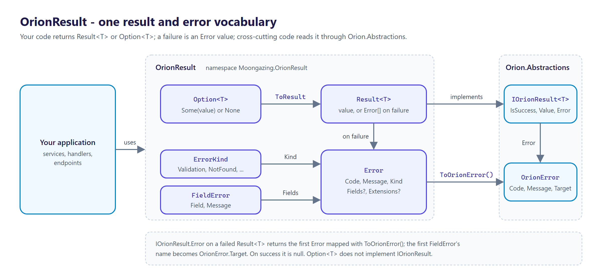
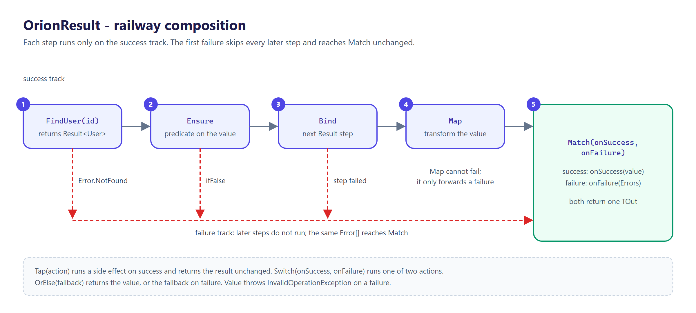
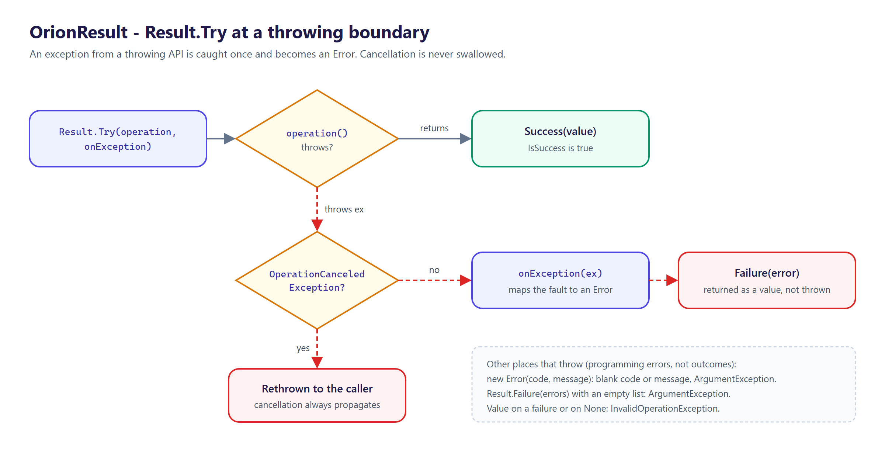

<p align="center">
  <picture>
    <source media="(prefers-color-scheme: dark)" srcset="docs/logo.png">
    
  </picture>
</p>

# OrionResult

[](https://github.com/tunahanaliozturk/OrionResult/actions/workflows/ci-cd.yml)
[](https://www.nuget.org/packages/OrionResult/)
[](LICENSE)


One error-model vocabulary for the **Orion** family. Most "failures" in real code are *expected* — validation rejected the input, the resource wasn't found, the caller isn't authorized — and modelling those as exceptions gives you invisible control flow, stack-trace tax, and forty different `catch` shapes at the HTTP boundary. So teams reach for a Result type, and now there are five of them, none agreeing on how a failure becomes a response.

OrionResult gives the family **one** `Result`/`Option`/`Error` vocabulary: a zero-alloc `Result<T>` struct, a structured `Error` (stable code + kind, not free-text), and the family's `IOrionResult` contract — so failures flow as data, not as control flow.



## Features

- **`Result<T>`** — a `readonly struct`, so the success path allocates nothing. Success carries the value; failure carries one or more `Error`s. Railway composition with `Map`, `Bind`, `Match`, `Ensure`, `Tap`, `OrElse`.
- **Structured `Error`** — a machine-readable `Code`, a human `Message`, an `ErrorKind` category, and optional field-level errors and extensions. Factory helpers (`Error.NotFound`, `Error.Validation`, …). Bridges to the spine's `OrionError`.
- **`Option<T>`** — "maybe absent", distinct from "failed with a reason". `Map`/`Bind`/`Match`/`OrElse`, `ToResult`, `FirstOrNone`.
- **Implicit conversions** keep call sites clean: `return value;` is a success, `return Error.NotFound(...);` is a failure.
- **Implements `IOrionResult<T>`** — cross-cutting code (and, in a later wave, the RFC 9457 `ProblemDetails` bridge) reads any Orion result the same way.
- **AOT- and trim-clean**, verified by a native-binary smoke test in CI; no reflection in the core. Multi-targets `net8.0`, `net9.0`, `net10.0`.

## Install

```bash
dotnet add package OrionResult
```

| Package | What it is |
|---------|------------|
| `OrionResult` | `Result<T>`, `Option<T>`, `Error`, `ErrorKind`, `FieldError` and the `Result` / `Option` factories. Depends only on `Orion.Abstractions`. |

## Quick start

```csharp
using Moongazing.OrionResult;

Result<User> FindUser(UserId id) =>
    repo.TryGet(id) is { } user
        ? user                                          // implicit T -> success
        : Error.NotFound("user.not_found", $"No user {id}"); // implicit Error -> failure

// Railway composition: each step runs only if the previous succeeded.
Result<ReceiptDto> Pay(UserId id, decimal amount) =>
    FindUser(id)
        .Ensure(u => u.IsActive, Error.Conflict("user.inactive", "User is deactivated"))
        .Bind(u => ChargeCard(u, amount))
        .Map(charge => new ReceiptDto(charge));

// Collapse to a value by handling both cases.
string message = Pay(id, 10m).Match(
    receipt => $"charged {receipt.Total}",
    errors  => $"failed: {errors[0].Code}");
```



`Option<T>` for "maybe absent":

```csharp
Option<Email> primary = user.Emails.FirstOrNone(e => e.IsPrimary);
Email best = primary.OrElse(Email.Empty);

// Turn absence into a typed failure when you need a Result.
Result<Email> required = primary.ToResult(Error.Validation("email.required", "A primary email is required"));
```

Catch a boundary exception once and convert it — a deliberate, local escape hatch:

```csharp
Result<Config> parsed = Result.Try(
    () => Config.Parse(raw),
    ex => Error.Validation("config.invalid", ex.Message));
```



## Versioning

Follows [Semantic Versioning](https://semver.org/). Multi-targets `net8.0`, `net9.0`, and `net10.0`. Binds to `Orion.Abstractions` 1.x. The RFC 9457 `ProblemDetails` / `ToHttpResult` HTTP mapping and async combinators arrive in later waves; this release is the core value types.

## Documentation

- [CHANGELOG.md](CHANGELOG.md) — release notes.
- [SECURITY.md](SECURITY.md) — how to report a vulnerability privately.

## Contributing

Contributions are welcome. See [CONTRIBUTING.md](CONTRIBUTING.md) and the [CODE_OF_CONDUCT.md](CODE_OF_CONDUCT.md).

## More from the Orion family

Focused .NET libraries built to one quality bar. Each is usable on its own; several share the small [`Orion.Abstractions`](https://github.com/tunahanaliozturk/Orion.Abstractions) contracts spine, but there is no deep dependency web — pick only what you need:

- [OrionGuard](https://github.com/tunahanaliozturk/OrionGuard) — validation, guard clauses, DDD primitives, domain events
- [Orion.Abstractions](https://github.com/tunahanaliozturk/Orion.Abstractions) — the shared contracts spine: telemetry, options, result, clock
- [OrionAudit](https://github.com/tunahanaliozturk/OrionAudit) — automatic EF Core change-audit trail
- [OrionBeacon](https://github.com/tunahanaliozturk/OrionBeacon) — leader election with fencing tokens
- [OrionClock](https://github.com/tunahanaliozturk/OrionClock) — testable time, TTLs, and deadlines
- [OrionGrant](https://github.com/tunahanaliozturk/OrionGrant) — permission / authorization checks
- [OrionKey](https://github.com/tunahanaliozturk/OrionKey) — source-generated strongly-typed IDs
- [OrionLedger](https://github.com/tunahanaliozturk/OrionLedger) — API-key issuance, verification, and rotation
- [OrionLens](https://github.com/tunahanaliozturk/OrionLens) — ambient correlation-context propagation
- [OrionLock](https://github.com/tunahanaliozturk/OrionLock) — distributed locks with fencing tokens
- [OrionOnce](https://github.com/tunahanaliozturk/OrionOnce) — idempotency keys for exactly-once request handling
- [OrionPatch](https://github.com/tunahanaliozturk/OrionPatch) — transactional outbox for EF Core
- [OrionRelay](https://github.com/tunahanaliozturk/OrionRelay) — outbound webhook delivery (HMAC, retries, backoff)
- [OrionSaga](https://github.com/tunahanaliozturk/OrionSaga) — sagas / process managers for long-running workflows
- [OrionShade](https://github.com/tunahanaliozturk/OrionShade) — sensitive-data redaction for logs and telemetry
- [OrionStream](https://github.com/tunahanaliozturk/OrionStream) — server-sent events / streaming hub
- [OrionVault](https://github.com/tunahanaliozturk/OrionVault) — field-level encryption for EF Core

See it all working together in [OrionShowcase](https://github.com/tunahanaliozturk/OrionShowcase), a production-shaped banking sample.

## License

[MIT](LICENSE).
